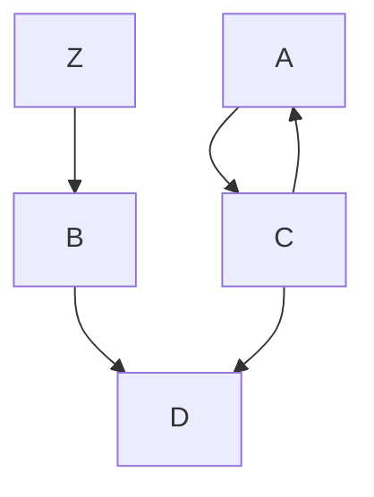

# Nome do projeto

Licença: GPLv3 https://www.gnu.org/licenses/gpl-3.0.html  
Versão: 0.1.0  

Mantenedor: Nome da Pessoa  
E-mail: suporte@ultrix.pro  
Estado: Em teste  
Data: 20230417  

(c) Copyright 2021, Ultrix

Este é um [link](https://docs.github.com/en/get-started/writing-on-github/getting-started-with-writing-and-formatting-on-github/basic-writing-and-formatting-syntax) para formatação básica markdown do Github.

Este é um [link](https://www.markdownguide.org/basic-syntax) geral para formatação básica markdown.

## Segundo nível

### Terceiro nível 1

Para fazer uma nova linha é necessário usar dois ou mais espaços no final.  
Esta é uma nova linha, logo depois de dois espaços na linha anterior.

**Frase em negrito**  
_Frase em itálico_

Lista sem ordem:  
- Item 1
- Item 2
- Item 3

Lista ordenada:
1. Item 1
1. Item 2
1. Item 3

Listas com sub-itens

1. Lista com sub-itens  
   - Primeiro sub-item  
1. Lista com sub-itens  
   - Segundo sub-item  

Código em uma linha:

`sox audio.ogg -t raw -r 8000 -e signed-integer -b 16 -c 1 audio.sln`

### Terceiro nível 2

Código em várias linhas usando três apóstrofos:

```
cliente_id;nome;email;telefone
1435;Nome1 Sobrenome1;nome1@hotmail.com;21989843245
2385;Nome2 Sobrenome2;nome2@hotmail.com;11995825666
2595;Nome3 Sobrenome3;nome3@outlook.com;71981991373
```

Código em várias linhas usando 4 espaços:

      ./chamadas.py importacsv --arquivo=arquivo.csv --nomelista=20210420
          --arquivo       arquivo a ser importado
          --nomelista     nome da lista que identificará a importação no banco de dados

### Terceiro nível 3

Fazendo tabelas:

| Field     | Type             | Null | Key | Default | Extra          |
|-----------|------------------|------|-----|---------|----------------|
| cod_envio | int(10) unsigned | NO   | PRI | NULL    | auto_increment |
| cod_nome  | int(10) unsigned | NO   |     | NULL    |                |
| campanha  | varchar(20)      | NO   |     | NULL    |                |
| datahora  | datetime         | NO   |     | NULL    |                |

A tabela não precisa estar necessariamente formatada com espaços:

| Field|Type|Null|Key|Default|Extra|
|-|-|-|-|-|-|
|cod_envio|int(10) unsigned|NO|PRI|NULL|auto_increment|
|cod_nome|int(10) unsigned|NO||NULL||
|campanha|varchar(20)|NO||NULL||
|datahora|datetime|NO||NULL||

## Segundo nível 2

Expressão matemática:

$\frac{\sqrt{3x-1}+(1+x)^2}{x^3}$

Gráfico:  




